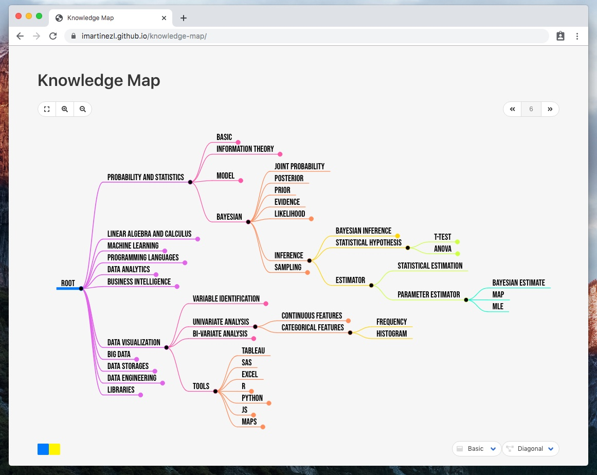

# knowledge-map

Mindmap of every concept, idea, technique, I had contact with, or interact in some way.
This could represent the concepts I can talk about, with less or more detail and competence.

Notes:
This is not a resource manager. It will only contain the name of the concepts.
Could be interesting to include tools related to those concepts, but I am not so sure about it
Cool options to have: interact with the mindmap on the web, and save different versions of the map on git for every change in the map, maybe?

Available tools for mindmap generation
https://mermaid-js.github.io/mermaid/#/

https://gojs.net/latest/index.html

https://github.com/jdebarochez/d3-mindmap

https://www.mindmeister.com/

http://freemind.sourceforge.net/wiki/index.php/Main_Page

https://www.mindjet.com/es/

https://github.com/learn-anything/react-mindmap

https://github.com/dundalek/markmap

## data-science-ontology

https://www.datascienceontology.org/
https://www.researchgate.net/publication/324957763_Big_Data_analytics_ontology
https://link.springer.com/chapter/10.1007/978-3-030-14401-2_16
https://projects.tib.eu/orkg/
https://github.com/IBM/datascienceontology
https://github.com/epatters/semanticflowgraph
https://medium.com/predict/where-ontologies-end-and-knowledge-graphs-begin-6fe0cdede1ed
https://towardsdatascience.com/the-data-fabric-for-machine-learning-part-1-2c558b7035d7
https://towardsdatascience.com/knowledge-graph-bb78055a7884
https://towardsdatascience.com/reconciling-your-data-and-the-world-with-knowledge-graphs-bce66b377b14

https://www.researchgate.net/publication/332471378_Artificial_Intelligence_Landscape_-_An_Introduction_in_Technology_Fields_Research_Areas
